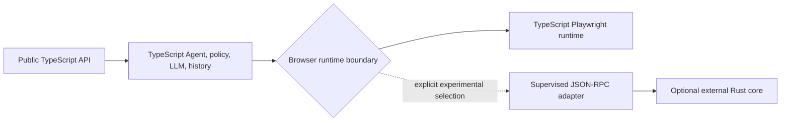

## Context

The Python upstream introduced an optional Rust-backed agent in June 2026. The
initial merge added a 6,592-line compatibility service and 7,625 lines of
focused tests. At the current upstream snapshot, the compatibility service has
grown to roughly 6,800 lines and the Python package pins a separate native
binary for five operating-system and CPU combinations.

The upstream integration is deliberately out of process. It starts a terminal
binary, negotiates protocol version 1 through `runtime.ping`, exchanges
line-delimited JSON-RPC on stdio, reconstructs Python history from streamed
events, and separately manages cancellation and browser cleanup. This proves
that a process boundary is viable, but it also exposes the cost of putting the
whole agent loop on the other side of that boundary.

This repository already owns a native TypeScript agent, LLM adapters, action
registry, security policy, history model, Playwright browser session, and npm
distribution. There is no benchmark from this repository showing that a Rust
runtime currently addresses its dominant bottleneck. Shipping another native
runtime would therefore be an architecture-level and supply-chain change, not
a mechanical port.

## Decision

Do not port, bundle, or enable the upstream Rust agent in the current
TypeScript package. TypeScript and Playwright remain the only production
runtime and the source of truth for public behavior.

If profiling later justifies a Rust experiment, it must follow these rules:

1. Rust may first supplement only the browser/DOM execution boundary. The
   TypeScript process retains the agent loop, LLM calls, action registry,
   allowed-domain enforcement, sensitive-data handling, history, and public
   API normalization.
2. The integration must use an optional supervised child process over a
   versioned stdio JSON-RPC contract. It must not use an in-process N-API
   binding and must not add a native binary to the default npm installation.
3. Selection must be explicit through an experimental API. The package must
   never silently switch runtimes, silently fall back after a partial run, or
   change the existing `Agent` and `BrowserSession` defaults.
4. A versioned machine-readable protocol schema and generated fixtures must be
   committed before a real binary adapter. `runtime.ping` must report protocol
   version, core version, and capabilities before any browser is launched.
5. Protocol stdout is reserved for frames; diagnostic output goes to stderr.
   Frames are bounded at 16 MiB. Larger screenshots and artifacts use opaque
   handles rooted in a per-run directory created and containment-checked by
   TypeScript.
6. The experiment cannot graduate until every promotion gate in this ADR is
   satisfied on the supported platform matrix and this ADR is accepted.

This diagram shows the only permitted dependency direction for an experiment:

The Rust process must not call back into private TypeScript modules or become
the owner of public history and policy semantics.

## Options considered

### Port the upstream full-agent wrapper

Rejected. It would require reconstructing actions, history, usage, hooks,
telemetry, screenshots, cancellation, and final results across the protocol.
The size and continued growth of the upstream compatibility layer indicate a
large permanent parity surface, and its Python-specific reconstruction logic
does not transfer directly to TypeScript.

### Bind Rust in process with N-API

Rejected for the first integration. Native crashes would take down the Node.js
process, ABI and packaging concerns would couple releases, and cancellation or
leak isolation would be weaker. The potential call-latency benefit is not yet
supported by a repository benchmark.

### Compile the core to WebAssembly

Rejected for the first integration. Browser control needs operating-system
process, network, filesystem, and CDP capabilities that do not map cleanly to a
portable WASM sandbox. It also does not eliminate the need for a stable
contract.

### Keep TypeScript only

This remains the production choice. It has the lowest compatibility and
distribution risk. Its drawback is that a demonstrated CPU-heavy DOM or
browser workload cannot benefit from Rust without reopening this decision.

### Evaluate a narrow optional process adapter

Selected as the only permitted future experiment. Process isolation, protocol
versioning, explicit selection, and an unchanged default make the experiment
reversible while preserving an opportunity to accelerate measured hot paths.

## Promotion gates

All gates are mandatory; meeting only a performance target is insufficient.

| Area              | Required evidence                                                                                                                                                                                                                                        |
| ----------------- | -------------------------------------------------------------------------------------------------------------------------------------------------------------------------------------------------------------------------------------------------------- |
| Scope             | A profiler identifies browser/DOM execution as a material bottleneck in at least two representative workloads.                                                                                                                                           |
| Performance       | On the affected workloads, Rust improves p95 end-to-end step latency by at least 20% or reduces process CPU time by at least 30%, while startup p95 and peak resident memory regress by no more than 10%.                                                |
| Behavioral parity | The same browser-session conformance suite passes against TypeScript and Rust for navigation, tabs, frames, forms, downloads, storage state, screenshots, cancellation, and error mapping.                                                               |
| Security          | Domain restrictions, redirect checks, filesystem containment, credential redaction, protocol-size limits, and artifact permissions have adversarial tests on both runtimes. Secrets never appear in process arguments, protocol logs, or crash messages. |
| Reliability       | A 1,000-run mixed-workload soak has no orphan processes, no cleanup timeout, and a crash or protocol-failure rate below 0.1%. Cancellation terminates the child and browser within two seconds.                                                          |
| Compatibility     | CI passes on macOS arm64/x64, Linux arm64/x64, and Windows x64 for every supported Node.js major. Protocol mismatch fails before launch with a typed, actionable error.                                                                                  |
| Distribution      | Native artifacts have checksums, provenance, an SBOM, license review, and a documented vulnerability response. Installing the default `browser-use` package downloads no Rust binary.                                                                    |
| Operations        | Metrics distinguish runtime, protocol version, startup time, request latency, child exit, frame rejection, cancellation, and cleanup. No metric contains URLs, page text, or credentials.                                                                |

## Compatibility and rollout

1. Establish TypeScript baselines and a runtime-neutral conformance harness.
2. Add protocol schemas, recorded fixtures, and a fake child process; exercise
   startup, timeout, malformed frames, backpressure, cancellation, and cleanup
   without shipping Rust.
3. Publish a separately selected experimental adapter and binary for internal
   CI only. Unsupported platforms fail before browser launch.
4. Run shadow benchmarks and opt-in canaries. Results must remain attributable
   to a runtime and protocol version.
5. Request architecture and security review with the complete gate evidence.
   Only an accepted revision of this ADR may widen availability.

Rollback removes the experimental selector and terminates its supervised child
process. Because TypeScript remains the default and owns public state, rollback
does not require history migration or API changes.

## Consequences

- The repository avoids an immediate native dependency and a second agent
  implementation.
- Public behavior, policy, and history remain reviewable in TypeScript.
- A future Rust experiment has a narrow, testable, and reversible boundary.
- Rust acceleration is delayed until profiling justifies its distribution and
  compatibility cost.
- Some upstream Rust capabilities may be unusable unless the upstream binary
  exposes a browser/DOM-level protocol instead of only a full-agent protocol.

## Risks

- Cross-process serialization may erase the expected performance gain. The
  end-to-end promotion target includes transport cost.
- A narrow browser boundary may still duplicate Playwright watchdog semantics.
  The shared conformance suite is a prerequisite, not follow-up cleanup.
- Platform-native artifacts expand supply-chain exposure. Separate optional
  distribution and provenance are required before user testing.
- Protocol evolution can strand adapters. Capability negotiation and fixtures
  must be versioned independently of npm package versions.

## Follow-up

- Capture CPU, memory, startup, DOM-size, screenshot, and step-latency baselines
  for representative TypeScript workloads.
- Inventory the smallest browser-session contract needed by the existing Agent
  without exposing Playwright objects.
- If the performance gate is plausible, propose the protocol schema and fake
  server as a reviewable change that contains no native binary.
- Revisit this ADR only with measured results and a named artifact owner.

## Verification

- Upstream scope was verified from local `origin` commits `6701a44a`,
  `e60a9ec0`, and `1e75d1f1`, plus the current `browser_use/beta/service.py` and
  `pyproject.toml` at `c9206829`.
- Current lightweight boundary enforcement runs with
  `pnpm exec vitest run test/architecture-boundaries.test.ts`.
- Current package and browser regression baselines run with `pnpm check`.
- No Rust runtime, native dependency, protocol implementation, or default
  behavior is introduced by this decision document.

## Citations

- [Initial upstream Rust agent integration](https://github.com/browser-use/browser-use/commit/6701a44a58353d5981f3dde6d9da563e8b27858b)
- [Upstream SDK server validation](https://github.com/browser-use/browser-use/commit/e60a9ec0fa95a02a58cb6ecd1fd0943c273b0970)
- [Upstream browser-use-core platform pin update](https://github.com/browser-use/browser-use/commit/1e75d1f1f3ae970ad673e479a2ac9b3b613f82be)
